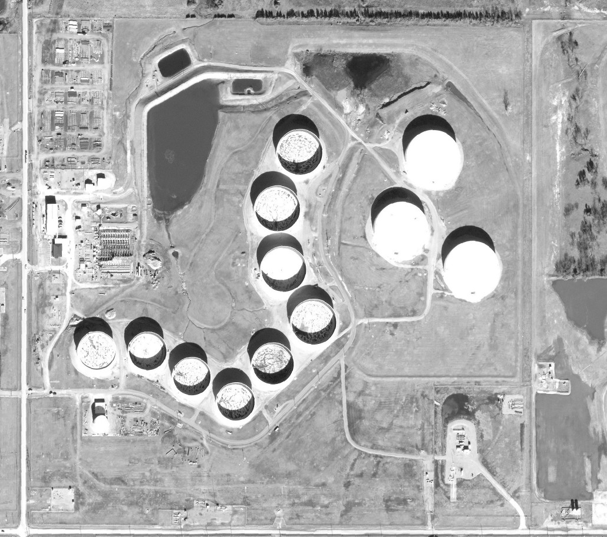

# oil-tank-measurer

This is a work in progress project exploring the possibility of estimating oil tank capacites through images alone. Using Python with NumPy and OpenCV, it is possible to measure the shadows inside and outside an oil tank. Using knowledge of the sensor resolution, we can calculate tank geometries and shadow lengths. With this information, it should be possible to estimate the height of the internal oil tank, i.e. the tank that contains the oil, and when comparing to the full volume, based on the external cylinder structure, we can estimate the capacity in barrels of oil.

 

## To Do
 
- Explore Hough transforms for tank radius calculation.
